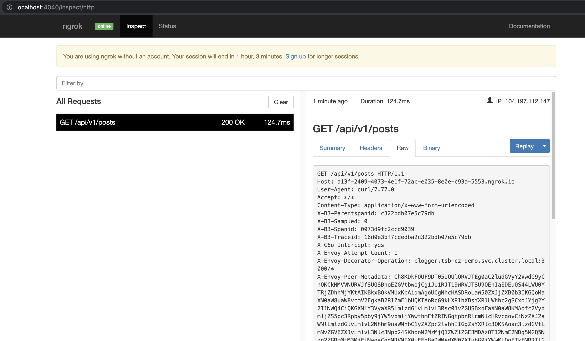

# tsb-codezero-demo
Using CodeZero with Tetrate Service Bridge


## Pre-requisite

* [CodeZero](https://docs.codezero.io/#/guides/installing) CLI installed on local
* TSB Demo installation or MP/CP installed on the cluster
* TSB IngressGateway with LoadBalancer service

## Steps

### Application Deployment

Create a target namespace for the CodeZero demo, Enable istio-injection in the namespace.

```
$: kubectl create ns tsb-cz-demo
$: kubectl label namespace tsb-cz-demo istio-injection=enabled --overwrite
```

Deploy Blogger App

```
$: kubectl apply -f blogger_credentials.yaml -n tsb-cz-demo
$: kubectl apply -f blogger_migration_job.yaml -n tsb-cz-demo
$: kubectl apply -f blogger_deployment.yaml -n tsb-cz-demo
$: kubectl apply -f blogger_service.yaml -n tsb-cz-demo
```

### TSB Configuration

Create Tenant, Groups, Ingress, Gateway configuration 

Tenant

```
    apiVersion: api.tsb.tetrate.io/v2
    kind: Tenant
    metadata:
    organization: tetrate
    name: marketing
    spec:
    displayName: Marketing

$: tctl apply -f /tsb/tenant.yaml
```

Workspace

```
    apiversion: api.tsb.tetrate.io/v2
    kind: Workspace
    metadata:
    organization: tetrate
    tenant: marketing
    name: marketing-ws
    spec:
    namespaceSelector:
        names:
        - "<cluster>/tsb-cz-demo"

$: tctl apply -f /tsb/workspace.yaml
```

Groups

```
    apiVersion: gateway.tsb.tetrate.io/v2
    kind: Group
    metadata:
    organization: tetrate
    tenant: marketing
    workspace: marketing-ws
    name: blogger-gw
    spec:
    displayName: blogger-gateway
    namespaceSelector:
        names:
        - "<cluster>/tsb-cz-demo"
    configMode: BRIDGED
    ---
    apiVersion: traffic.tsb.tetrate.io/v2
    kind: Group
    Metadata:
    organization: tetrate
    tenant: marketing
    workspace: marketing-ws
    name: blogger-traffic
    spec:
    displayName: blogger-traffic-group
    namespaceSelector:
        names:
        - "<cluster>/tsb-cz-demo"
    configMode: BRIDGED
    ---
    apiVersion: security.tsb.tetrate.io/v2
    kind: Group
    Metadata:
    organization: tetrate
    tenant: marketing
    workspace: marketing-ws
    name: blogger-security
    spec:
    displayName: blogger-security-group
    namespaceSelector:
        names:
        - "<cluster>/tsb-cz-demo"
    configMode: BRIDGED

$: tctl apply -f groups.yaml
```

Ingress LoadBalancer

```
    apiVersion: install.tetrate.io/v1alpha1
    kind: IngressGateway
    metadata:
    name: tsb-gateway-blogger
    namespace: tsb-cz-demo
    spec:
    kubeSpec:
        service:
        type: LoadBalancer

$: kubectl apply -f ingress.yaml
```

IngressGateway

```
apiVersion: gateway.tsb.tetrate.io/v2
kind: IngressGateway
Metadata:
  organization: tetrate
  name: blogger-gw-ingress
  group: blogger-gw
  workspace: marketing-ws
  tenant: marketing
spec:
  workloadSelector:
    namespace: tsb-cz-demo
    labels:
      app: tsb-gateway-blogger
  http:
    - name: blogger
      port: 8080
      hostname: "blogger.tetrate.com"
      routing:
        rules:
          - route:
              host: "tsb-cz-demo/blogger.tsb-cz-demo.svc.cluster.local"
```

### Verify Application Deployment and TSB

```
$: export INGRESS_IP=`(kubectl get svc tsb-gateway-blogger -n tsb-cz-demo --output=jsonpath="{.status.loadBalancer.ingress[0]['hostname','ip']}")`
$: curl -i http://$INGRESS_IP/api/v1/posts -H"Host: blogger.tetrate.com"
HTTP/1.1 200 OK
server: istio-envoy
date: Mon, 04 Apr 2022 17:27:52 GMT
content-type: application/json; charset=utf-8
x-frame-options: SAMEORIGIN
x-xss-protection: 1; mode=block
x-content-type-options: nosniff
x-download-options: noopen
x-permitted-cross-domain-policies: none
referrer-policy: strict-origin-when-cross-origin
vary: Accept
etag: W/"e77bc2ad26feaa628f49d73b12915e62"
cache-control: max-age=0, private, must-revalidate
x-request-id: 35d0f2cc-f872-4fbb-8f7d-da679b1c9360
x-runtime: 0.011193
x-envoy-upstream-service-time: 17
transfer-encoding: chunked

{"posts":[{"id":3,"title":"user 20 - my first post","content":"Recusandae minima consequatur. Expedita sequi blanditiis. Ut fuga et.","author":"user1"}]}%
```


### Setup Local development environment for Blogger

```
$: git clone git@github.com:sreeharikmarar/blogger.git
$: cd blogger
$: bundle instal
$: make config-copy
$: make docker.start
$: bundle exec rails s
```

### Verify Local application

curl http://localhost:3000/api/v1/posts
{"posts":[{"id":1,"title":"my first post","content":"Recusandae minima consequatur. Expedita sequi blanditiis. Ut fuga et.","author":"user1"}]}


## Intercept Blogger Traffic from remote cluster to local instance

```
$: czctl intercept service blogger -n tsb-cz-demo

✔  Initiating intercept                                                                         Done
✔  Intercept request received                                                                   Done
✔  Validating intercept parameters                                                              Done
✔  Starting intercept session for blogger in tsb-cz-demo                                        Done
✔  Starting tunnel worker process                                                               Done
✔  Updating routes for blogger in tsb-cz-demo                                                   Done
✔  Adding intercept for blogger in tsb-cz-demo                                                  Done
✔  Connecting remote service to local tunnel                                                    Done

```

### Verify traffic has been intercepted by codezero

Set `X-C6O-INTERCEPT: yes` header

```
$: curl -i  --location --request GET 'http://blogger.tetrate.com/api/v1/posts' \
--header 'X-C6O-INTERCEPT: yes' \
--data-raw ''
HTTP/1.1 200 OK
server: istio-envoy
date: Mon, 04 Apr 2022 17:37:20 GMT
content-type: application/json; charset=utf-8
cache-control: max-age=0, private, must-revalidate
etag: W/"a0d9f5325f8cea49ccc1f1de30e0cade"
ngrok-agent-ips: 2409:4073:4e1f:72ab:e035:8e0e:c93a:5553
referrer-policy: strict-origin-when-cross-origin
vary: Accept
x-content-type-options: nosniff
x-download-options: noopen
x-frame-options: SAMEORIGIN
x-permitted-cross-domain-policies: none
x-request-id: 77e6e769-c1dd-4262-baec-1e38a1ab967e
x-runtime: 0.042536
x-xss-protection: 1; mode=block
x-envoy-upstream-service-time: 398
transfer-encoding: chunked

{"posts":[{"id":1,"title":"my first post","content":"Recusandae minima consequatur. Expedita sequi blanditiis. Ut fuga et.","author":"user1"}]}%
```

You will see the response from the service running locally being intercepted. 

You can also open `ngrok` dashboard http://localhost:4040 to inspect the request. 



